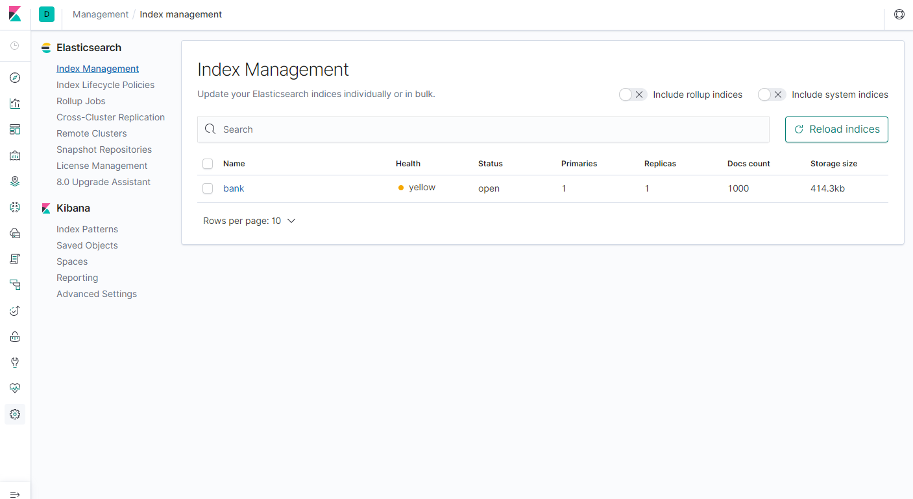

🌙 docker-elasticsearch
====


## 📗 プロジェクトの概要

ElasticSearch のサンプルです。Dockerを起動するとElasticSearch を利用する為の環境が整います。

## 🌐 Demo

### Kibana
http://localhost:5601/




## 🔧 開発環境の構築

```
# Docker起動時にエラーが発生する場合は仮想メモリを増やす設定をする
sysctl -w vm.max_map_count=262144
```

```
# Docker でSwaggerを起動します。
$ ./dc.sh start

# Docker を停止します。
$ ./dc.sh stop
```

## 💬 ElasticSearchの使い方

### Indexの生成
costomerというIndexを作成（MySQLでいうところのスキーマにあたる)<br>
`?pretty`をつけるとレスポンスのJSONが整形されて出力されます
```
$ curl -XPUT 'localhost:9200/customer?pretty'
```

### Indexの確認
```
$ curl 'localhost:9200/_cat/indices?v'
health status index    uuid                   pri rep docs.count docs.deleted store.size pri.store.size
yellow open   customer             92JO881oRpiPpcx1BSiYjw   1   1          0            0       230b           230b
```

### Typeの生成とDocumentの追加
externalというtypeを作成（MySQLでいうところのTableにあたる）
`/1` でidを指定してレコード追加しています。
idを指定しないと、適当なidが付与されます。
```
$ curl -H 'Content-Type: application/x-ndjson' -XPOST 'localhost:9200/customer/external/1?pretty' -d '
{
  "name": "John Doe"
}'
```

### Documentの確認
`id=1`のtypeを確認します。
```
$ curl -XGET 'localhost:9200/customer/external/1?pretty'
```

### Documentの変更
```
$ curl -H 'Content-Type: application/x-ndjson' -XPOST 'localhost:9200/customer/external/1/_update?pretty' -d '
{
  "doc": { "name": "Ise", "age": 20 }
}'
```

### Documentの削除
```
$ curl -XDELETE 'localhost:9200/customer/external/1?pretty'
```

### Indexの削除
```
$ curl -XDELETE 'localhost:9200/customer?pretty'
```

### サンプルデータを取り込む
```
$ unzip accounts.zip
$ curl -H 'Content-Type: application/x-ndjson' -XPOST 'http://localhost:9200/bank/account/_bulk?pretty' --data-binary @accounts.json

# データを確認する
$ curl -XGET 'http://localhost:9200/_cat/indices?v'
health status index    uuid                   pri rep docs.count docs.deleted store.size pri.store.size
yellow open   bank     wxooemXLSJqIraatTDJM6Q   1   1       1000            0    414.2kb        414.2kb

# レコードを検索（デフォルトは先頭から10件）
$ curl 'localhost:9200/bank/_search?q=*&pretty'

# "account_number"のカラムを降順に11番目のレコードから3件を検索して、"account_number", "balance"の２つのみ取得する
$ curl -H 'Content-Type: application/x-ndjson' -XPOST 'localhost:9200/bank/_search?pretty' -d '
{
  "query": { "match_all": {} },
  "_source": ["account_number", "balance"],
  "sort": { "account_number": { "order": "desc" } },
  "from": 10,
  "size": 3
}'

# "address"に"mill"と"lane"のどちらも含まれるものを検索する。
curl -H 'Content-Type: application/x-ndjson' -XPOST 'localhost:9200/bank/_search?pretty' -d '
{
  "query": {
    "bool": {
      "must": [
        { "match": { "address": "mill" } },
        { "match": { "address": "lane" } }
      ]
    }
  }
}'

```


## 🎨 参考

| プロジェクト| 概要|
| :---------------------------------------| :-------------------------------|
| [Elasticsearch 超入門](https://qiita.com/bbbks9/items/7695262be0befb94897f)| Elasticsearch 超入門|
| [Elasticserachをlocalhost以外で起動する方法](https://qiita.com/TomatoCastle/items/12474753aa8b002db9ca)| Elasticserachをlocalhost以外で起動する方法|
| [Elasticsearch Guide](https://www.elastic.co/guide/en/elasticsearch/reference/current/index.html)| Elasticsearch Guide|


## 🎫 Licence

[MIT](https://github.com/isystk/docker-elasticsearch/blob/master/LICENSE)

## 👀 Author

[isystk](https://github.com/isystk)

